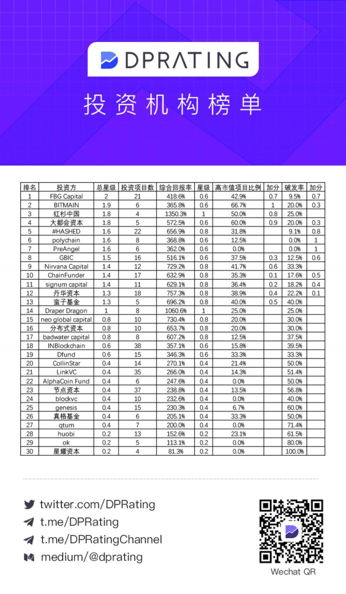

# 1c0_knowledge

## 资本
+ 收益
    * [【大炮榜单】机构论剑！基金排名震撼发布，你还在傻傻跟投？](https://www.linksfin.com/article/66710)
        - 
    * [2018中国区块链投资机构20强.pdf](docs/2018_vc_top20.pdf)
+ 口碑
    * INB, 创世不受待见
    * 节点资本也要小心
    * 丹华, fbg 之前口碑比较好，现在也项目太泛滥
    * 有的项目方很可能只是拿个机构投资的名头好上交易所，机构可能没投多少，反正你也不知道

## 机构 & 代投
+ 瑞士站
+ ico500
+ leek
+ tokeneed
+ 皇马
+ https://www.linkblock.com

## 基础知识

+ 荷兰拍
    * 优点
        - 雷电网络荷兰拍卖时适逢熊市，募集的eth不多，发币后上了币安有好几倍的收益
        - 如果募集的eth多的话, 收益也就没多少了
            + 对于任何项目来说，估值过高都会影响到投资人收益
+ KYC
   * Know your customer, 確認客戶身份,確認符合反賄賂标准,預防身份盗窃、金融詐騙、洗錢及恐怖主义融资.
+ AML
   + Anti money laundering, 反洗钱
+ 比例
+ 锁仓，解锁
+ 流通量
+ 基石轮
+ 私募轮
+ 公墓轮/众筹
+ 白名单
+ v 神点赞靠谱吗
    * bkx 了解一下
+ v 神站台/顾问靠谱吗
    * trst 了解一下
+ 硬顶
   * 筹的代币数目或者代币金额达到确定的上限时立刻结束，硬顶可以认为是ICO达到其最高融资额度就停止的指标。
+ 软顶
   * 触发条件，当达到这个触发条件时，众筹规则将会发生一定的改变。
+ 盘子拉升
   + 如果币集中在项目方手里，项目方能控盘好拉升
   + 理论上，持有总量 10% 的币就能拉升一个币?
